# Highly Available 3-Tier E-Commerce / Order Management Application on AWS

**AWS Cloud Practical Documentation**

## 1. Architecture Overview

This project implements a highly available 3-tier application on AWS across two Availability Zones. The presentation/delivery layer uses Route 53, CloudFront and S3; the application layer uses an internet-facing Application Load Balancer, Auto Scaling and EC2; and the database layer uses Amazon RDS in private database subnets. Event-driven processing uses EventBridge, Lambda, DynamoDB and SNS.

### 3-Tier AWS Architecture Diagram

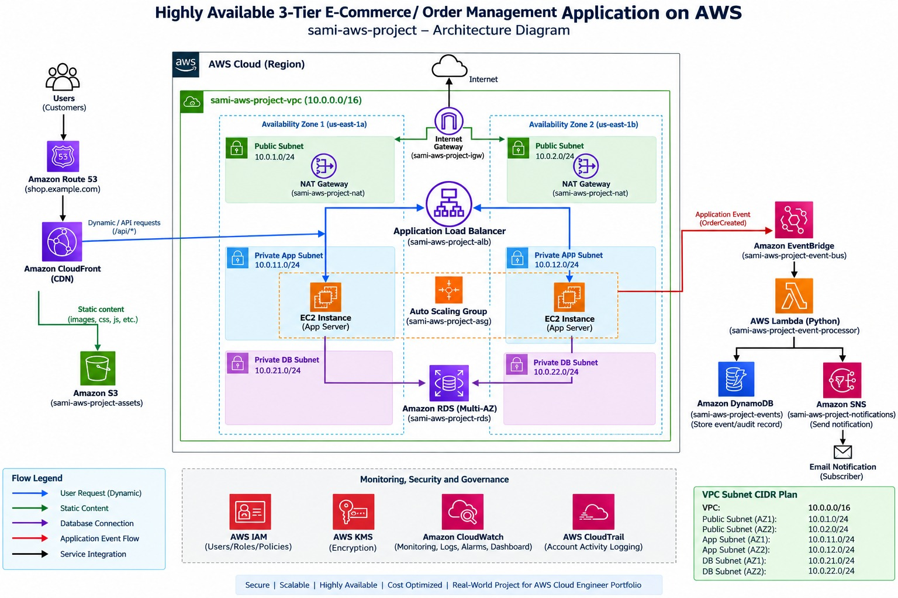

---

## 2. Architecture Components

- **Amazon Route 53:** DNS service used for the application domain.
- **Amazon CloudFront:** CDN used to deliver static content and route application requests.
- **Amazon S3:** Stores static assets such as images, CSS and JavaScript.
- **Amazon VPC:** Isolated network containing public, private application and private database subnets.
- **Internet Gateway:** Provides internet connectivity for public subnet resources.
- **NAT Gateway:** Provides outbound internet access for private application resources.
- **Application Load Balancer:** Receives application traffic and distributes it to healthy EC2 instances.
- **Auto Scaling Group:** Maintains application-server capacity and replaces unhealthy instances.
- **Amazon EC2:** Runs the application/web servers in private application subnets.
- **Amazon RDS:** Provides the relational database in private database subnets.
- **EventBridge:** Receives application events such as `OrderCreated`.
- **AWS Lambda:** Processes events using Python.
- **DynamoDB:** Stores event/audit records.
- **SNS:** Publishes notification messages to subscribers.
- **IAM / KMS / CloudWatch / CloudTrail:** Provide access control, encryption, monitoring and account activity logging.

---

## 3. VPC and Subnet Plan

| Component | CIDR | Availability Zone |
|---|---|---|
| VPC | `10.0.0.0/16` | Region |
| Public Subnet 1 | `10.0.1.0/24` | `us-east-1a` |
| Public Subnet 2 | `10.0.2.0/24` | `us-east-1b` |
| Private App Subnet 1 | `10.0.11.0/24` | `us-east-1a` |
| Private App Subnet 2 | `10.0.12.0/24` | `us-east-1b` |
| Private DB Subnet 1 | `10.0.21.0/24` | `us-east-1a` |
| Private DB Subnet 2 | `10.0.22.0/24` | `us-east-1b` |

### VPC / Subnet Configuration

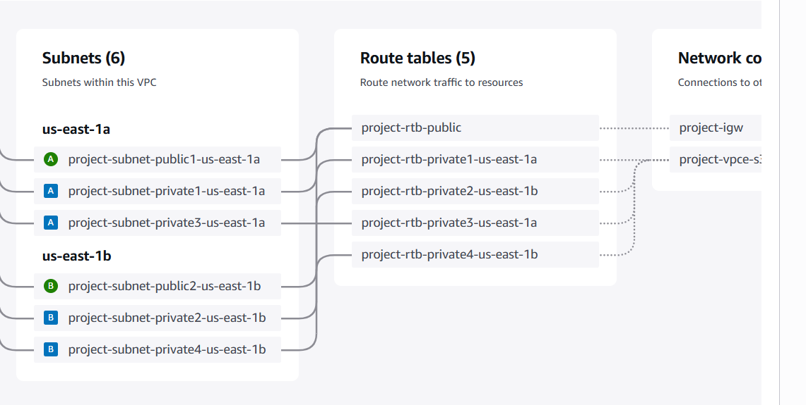

---

## 4. Step-by-Step Creation Process

### Step 1: Create the VPC

Create `sami-aws-project-vpc` with CIDR `10.0.0.0/16`.

### Step 2: Create Subnets

Create two public, two private application and two private database subnets across `us-east-1a` and `us-east-1b` using the CIDRs above.

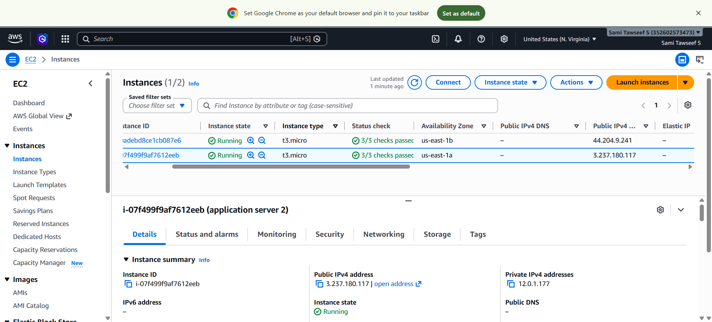

### Step 3: Create Internet Gateway

Create `sami-aws-project-igw`, attach it to the VPC, and configure the public route table for internet-bound traffic.

### Step 4: Create NAT Gateway

Create NAT Gateway infrastructure in a public subnet and associate an Elastic IP. Configure private application routes for outbound internet access.

### Step 5: Configure Route Tables

Associate public subnets with public routes, private application subnets with NAT routes, and keep database subnets private.

### Step 6: Configure Security Groups

Allow HTTP/HTTPS to the ALB, application traffic from ALB to EC2, and database traffic from the application security group to RDS.

### Step 7: Launch EC2 Servers

Launch application servers in the private application subnets. Install the web/application software and deploy the application.

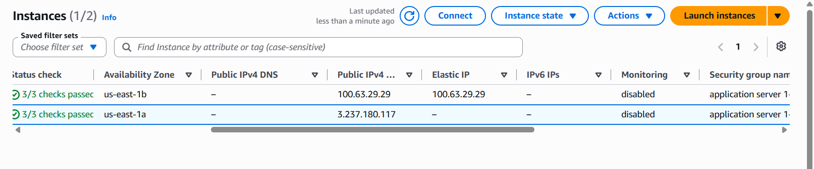

### Step 8: Create Target Group

Create `application-grp` using HTTP port 80, configure health checks, and register the EC2 instances.

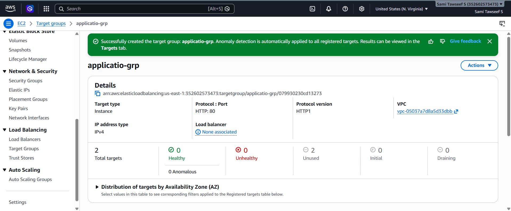

### Step 9: Create Application Load Balancer

Create `application-load` as an internet-facing ALB across both public subnets. Add a listener and forward traffic to `application-grp`.

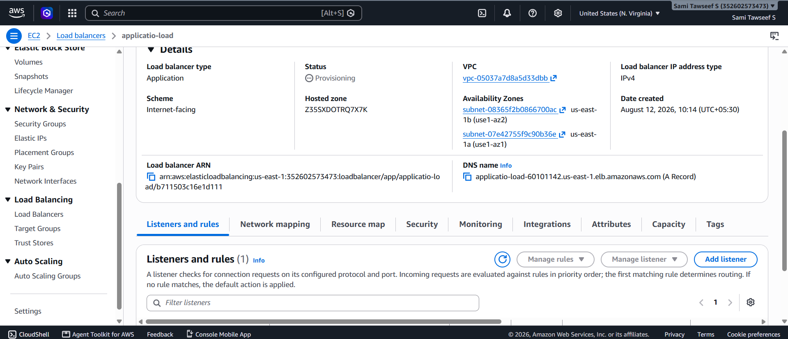

### Step 10: Create Auto Scaling Group

Create a Launch Template, then an Auto Scaling Group using the private application subnets. Attach it to the target group and configure desired/minimum/maximum capacity.

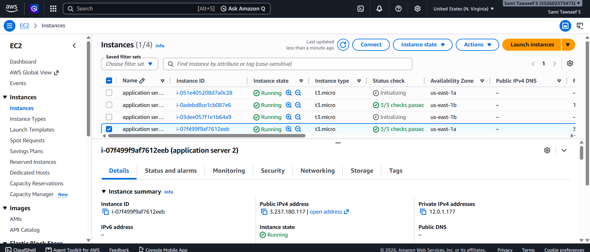

### Step 11: Create RDS

Create a DB subnet group using both private database subnets. Launch the RDS database privately and restrict access to the application tier.

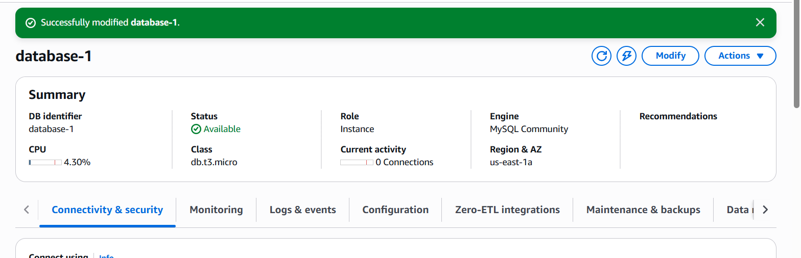

### Step 12: Connect Application to RDS

Configure the application with the RDS endpoint and database credentials/secret, then test connectivity.

### Step 13: Create S3 Bucket

Create `sami-aws-project-assets` and upload static assets. Configure encryption and required access.

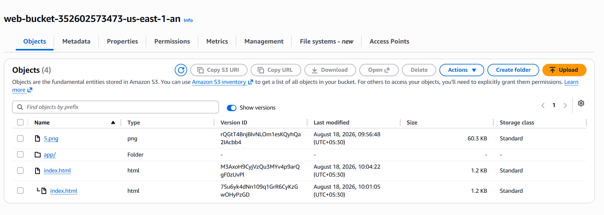

### Step 14: Create CloudFront Distribution

Use S3 as the static-content origin and configure the required application behavior for dynamic/API traffic.

### Step 15: Configure Route 53

Create the required DNS record for the application domain and point it to the appropriate CloudFront/application entry point.

### Step 16: Configure EventBridge

Create an event bus/rule for an event such as `OrderCreated` and configure Lambda as the target.

### Step 17: Create Lambda

Create `sami-aws-project-event-processor` using Python and grant its required IAM permissions.


### Step 18: Configure DynamoDB and SNS

Create the event/audit DynamoDB table and SNS notification topic. Configure Lambda to store events and publish notifications.

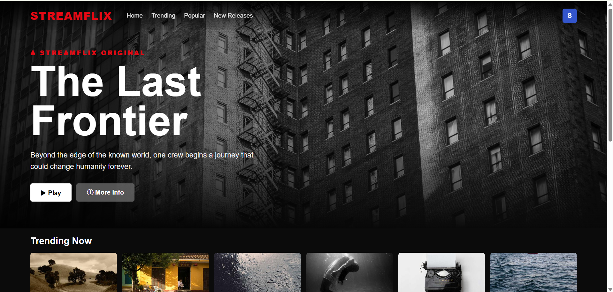

### Step 19: Configure Monitoring and Governance

Use IAM, KMS, CloudWatch and CloudTrail for permissions, encryption, monitoring, alarms, logs and auditing.


### Step 20: Test End-to-End Flow

Test DNS, static content, ALB routing, EC2 health, RDS connectivity, Auto Scaling, EventBridge, Lambda, DynamoDB and SNS notification.

---

## 5. Application Flow

- **Customer → Route 53 → CloudFront**
- **Static content → CloudFront → S3**
- **Dynamic/API request → CloudFront → Application Load Balancer → healthy EC2 application server**
- **Application server → Amazon RDS**
- **OrderCreated event → EventBridge → Lambda (Python)**
- **Lambda → DynamoDB** for event/audit storage
- **Lambda → SNS → Email notification subscriber**

### Application / Website Output


---

## 6. High Availability and Security

- Two Availability Zones provide resilience against an Availability Zone failure.
- Application EC2 instances run in private subnets behind the Application Load Balancer.
- Auto Scaling maintains application capacity and replaces unhealthy instances.
- RDS is placed in private database subnets and protected by security-group rules.
- Public and private tiers are separated using subnets and route tables.
- CloudWatch provides monitoring, logs, alarms and dashboards; CloudTrail provides account activity logging.
- IAM provides controlled permissions and KMS supports encryption/key management.

### Additional Implementation Screenshots


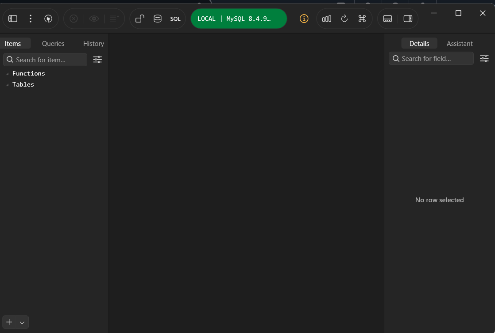

---

## 7. Output / Implementation Screenshots

### 3-Tier AWS Architecture Diagram


### VPC and Subnet Configuration


### AWS Infrastructure Configuration


### EC2


### Target Group


### Application Load Balancer


### Auto Scaling


### S3


### Lambda / Event Processing


### Application Output


### ALB Details


### CloudWatch


### RDS


### Console / Application Configuration


---

## 8. Verification Checklist

- [ ] VPC and all planned subnets are created.
- [ ] Internet Gateway and public routing are configured.
- [ ] NAT Gateway and private application routing are configured.
- [ ] EC2 application servers are running and healthy.
- [ ] Target group reports healthy targets.
- [ ] ALB listener forwards traffic to the target group.
- [ ] Application is reachable through the ALB endpoint.
- [ ] RDS is Available and reachable only from the application tier.
- [ ] S3 and CloudFront serve the required static content.
- [ ] Route 53 DNS resolves the application domain.
- [ ] EventBridge invokes Lambda for the configured application event.
- [ ] Lambda stores event data in DynamoDB and publishes SNS notifications.
- [ ] CloudWatch monitoring and CloudTrail logging are configured.

---

## 9. Final Result

The completed architecture provides a secure, scalable and highly available 3-tier AWS application. The application tier is distributed across two Availability Zones behind an Application Load Balancer, Auto Scaling supports resilience, the database remains private, and EventBridge/Lambda/DynamoDB/SNS provide event-driven processing and notification. IAM, KMS, CloudWatch and CloudTrail provide security and governance.

---

## Repository Structure

```text
AWS_3_Tier_Architecture_README/
├── README.md
└── github_images/
    ├── image1.jpeg
    ├── image2.png
    ├── image3.png
    ├── image4.png
    ├── image5.png
    ├── image6.png
    ├── image7.png
    ├── image8.png
    ├── image9.png
    ├── image10.png
    ├── image11.png
    ├── image12.png
    ├── image13.png
    └── image14.png
```

> **Note:** The image paths are written as relative Markdown paths (`github_images/...`), so the images will render correctly when `README.md` and the `github_images` folder are uploaded together to GitHub.
