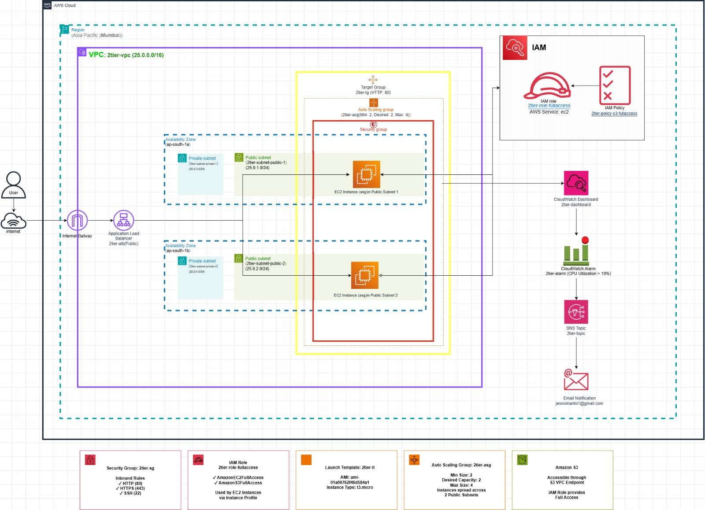
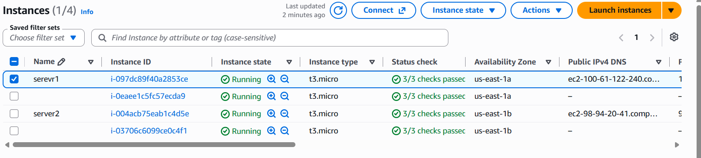
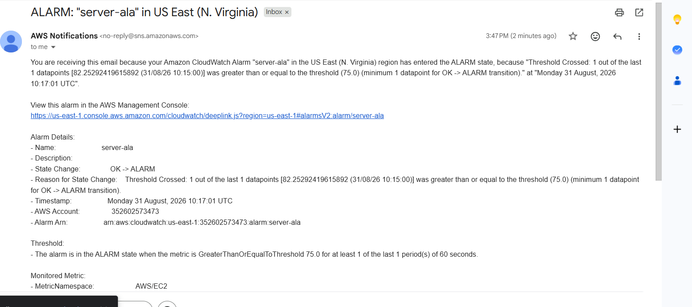
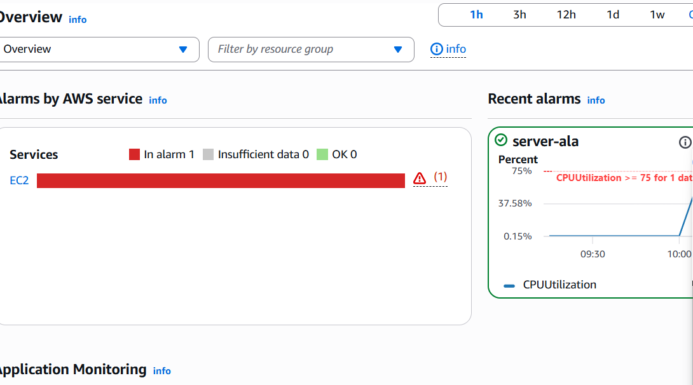
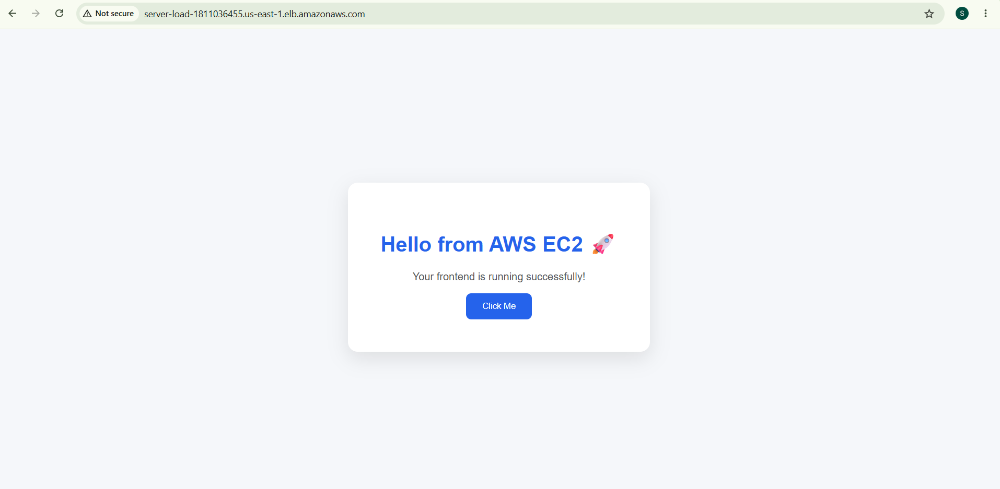
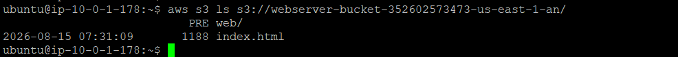

# AWS Practical Documentation

A collection of AWS practical exercises and step-by-step deployment documentation.

## Contents

- [AWS 2-Tier Architecture](#aws-2-tier-architecture)
- [AWS Cloud Practical Documentation](#aws-cloud-practical-documentation)
- [AWS EC2 Application Deployment](#aws-ec2-application-deployment)
- [AWS Elastic Beanstalk](#aws-elastic-beanstalk)
- [AWS Practical Documentation](#aws-practical-documentation)
- [AWS RDS MySQL](#aws-rds-mysql)
- [AWS RDS PostgreSQL](#aws-rds-postgresql)
- [AWS EFS & IAM](#aws-efs--iam)

---

## AWS 2-Tier Architecture

### 1. Project Objective

The objective of this practical is to create a two-tier AWS application architecture that provides network isolation, load balancing, high availability, automatic EC2 instance management, controlled AWS-service access, object storage, monitoring, and email notification.

The supplied architecture shows an Internet-facing Application Load Balancer in front of EC2 instances managed by an Auto Scaling Group. CloudWatch monitors the environment and sends alarm notifications through Amazon SNS. IAM provides permissions to EC2, while an S3 VPC Endpoint provides private connectivity to Amazon S3.

### 2. Architecture Diagram

Figure 1. Supplied AWS 2-tier architecture diagram.

### 3. Architecture Components

### 4. Creation Theory / Procedure

## 4.1 Select the AWS Region

Log in to the AWS Management Console and select the region required for the architecture.

The supplied architecture diagram identifies Asia Pacific (Mumbai) as the design region.

Create the required networking and application resources within the selected region.

## 4.2 Create the VPC

Open Amazon VPC and create a VPC named 2tier-vpc.

Use the CIDR block 25.0.0.0/16 as shown in the supplied architecture.

The VPC forms the isolated network boundary for the application.

## 4.3 Create Availability Zones and Subnets

Use two Availability Zones for resilience: ap-south-1a and ap-south-1b.

Create Public Subnet 1 (2tier-subnet-public-1, 25.0.1.0/24) in ap-south-1a.

Create Public Subnet 2 (2tier-subnet-public-2, 25.0.2.0/24) in ap-south-1b.

Create Private Subnet 1 (2tier-subnet-private-1, 25.0.3.0/24) in ap-south-1a.

Create Private Subnet 2 (2tier-subnet-private-2, 25.0.4.0/24) in ap-south-1b.

## 4.4 Create and Attach the Internet Gateway

Create an Internet Gateway and attach it to the 2tier-vpc.

The Internet Gateway provides the connection between the VPC and the public internet for routes that use it.

## 4.5 Configure Route Tables

Create a public route table and associate it with the two public subnets.

Add the default internet route 0.0.0.0/0 pointing to the Internet Gateway.

Create a separate private route table and associate it with the two private subnets.

Keep private resources from receiving direct inbound internet access.

## 4.6 Create the Security Group

Create the security group 2tier-sg.

Allow HTTP on port 80, HTTPS on port 443, and SSH on port 22 as shown in the supplied architecture.

The security group acts as a virtual firewall for the EC2 instances.

## 4.7 Create the IAM Role

Create the IAM role 2tier-role-fullaccess for EC2.

Attach the required EC2 and S3 permissions shown in the architecture.

Use the role through an EC2 instance profile so that the instances can obtain AWS permissions without embedding access keys in the server.

## 4.8 Create the Launch Template

Create the launch template 2tier-lt.

Specify the AMI, instance type, IAM instance profile, security group, storage, and required user-data/application configuration.

The launch template serves as the standard blueprint for EC2 instances created by Auto Scaling.

## 4.9 Create the Target Group

Create the target group 2tier-tg.

Use Instances as the target type, HTTP protocol, and port 80.

Configure an HTTP health check and use / as the health-check path.

The target group identifies healthy EC2 instances that can receive application traffic.

## 4.10 Create the Application Load Balancer

Create an Internet-facing Application Load Balancer.

Select the VPC and the two public subnets in the design.

Configure an HTTP listener on port 80.

Forward listener traffic to 2tier-tg.

Users access the application through the Load Balancer DNS name rather than depending on an individual EC2 public IP.

## 4.11 Create the Auto Scaling Group

Create the Auto Scaling Group 2tier-asg using the 2tier-lt launch template.

Set minimum capacity to 2, desired capacity to 2, and maximum capacity to 4.

Use the two Availability Zones/subnets required by the design.

Attach the Auto Scaling Group to the target group so new instances can automatically become load-balancer targets.

## 4.12 Deploy and Validate the Application

Deploy the web/application files consistently on the EC2 instances.

Ensure the application responds on the configured HTTP port.

Verify that the target group reports the required instances as healthy.

Open the Application Load Balancer DNS name in a browser and confirm that the application page loads.

## 4.13 Create the S3 Bucket and VPC Endpoint

Create an Amazon S3 bucket for application objects or other required data.

Keep the bucket private unless public access is specifically required.

Create an S3 VPC Endpoint and associate it with the required VPC route tables.

Use the EC2 IAM role to provide the required S3 permissions.

## 4.14 Configure CloudWatch Dashboard

Create the CloudWatch dashboard 2tier-dashboard.

Add relevant EC2 and Auto Scaling metrics such as CPU utilization, network activity, instance status, and capacity information.

The dashboard provides a centralized view of infrastructure health.

## 4.15 Create CloudWatch Alarm and SNS Notification

Create a CloudWatch CPU utilization alarm using the required threshold.

The supplied architecture shows a CPU threshold greater than 10%, while the supplied execution email demonstrates a separate alarm named server-ala with a threshold of 75%.

Create the SNS topic 2tier-topic.

Subscribe the required email address to the SNS topic and confirm the subscription.

When the CloudWatch alarm enters the ALARM state, SNS delivers the notification.

### 5. End-to-End Architecture Flow

The application request begins with the user and travels through the public networking layer to the Application Load Balancer. The ALB forwards traffic to healthy EC2 instances registered in the target group. The Auto Scaling Group maintains the required EC2 capacity.

User → Internet

Internet → Internet Gateway

Internet Gateway → Application Load Balancer

Application Load Balancer → Target Group

Target Group → Healthy EC2 instances

Auto Scaling Group → Maintains/replaces EC2 capacity

EC2 → IAM Role → Required AWS services

EC2/VPC → S3 VPC Endpoint → Amazon S3

EC2/Application → CloudWatch metrics

CloudWatch Alarm → SNS Topic → Email Notification

### 6. High Availability and Security Concept

Two Availability Zones reduce dependence on a single Availability Zone.

Two EC2 instances provide baseline application availability.

The Application Load Balancer distributes requests among healthy targets.

Auto Scaling can add capacity up to the configured maximum and replace failed instances.

Security groups restrict network access to defined ports.

IAM roles provide AWS permissions without requiring long-lived access keys on EC2.

An S3 VPC Endpoint provides private VPC-to-S3 connectivity.

CloudWatch and SNS provide monitoring and notification.

### 7. Execution / Output Evidence

The following screenshots were supplied as proof of the completed practical. They are included without alteration and are presented as execution evidence.

Figure 2. EC2 Instances – server1 and server2 are shown running; instances are distributed across us-east-1a and us-east-1b in this screenshot.

Auto Scaling Group Output Explanation

The EC2 Instances screenshot also serves as evidence of the Auto Scaling Group output. The console shows four running t3.micro instances distributed across two Availability Zones (us-east-1a and us-east-1b). The named instances server1 and server2 are visible, while the additional running instances demonstrate that the environment contains multiple instances that can be managed by the Auto Scaling Group.

In the architecture design, the Auto Scaling Group is configured with Minimum = 2, Desired = 2, and Maximum = 4. Therefore, the ASG maintains a baseline of two instances and can increase capacity up to four instances when scaling conditions require it. The screenshot showing four running instances is consistent with the configured maximum capacity and demonstrates the scaling capability.

Expected ASG behavior: when additional capacity is required, the Auto Scaling Group launches new instances from the Launch Template and registers them with the Target Group. If an instance becomes unhealthy or terminates, the Auto Scaling Group can launch a replacement so that the required capacity is maintained.

Output Result: Auto Scaling / EC2 instance provisioning – Successful

Figure 3. CloudWatch/SNS email notification – alarm server-ala entered ALARM state because CPU utilization crossed the configured 75% threshold.

Figure 4. CloudWatch Alarm Overview – server-ala is shown under EC2 alarms and the CPUUtilization graph crosses the 75% threshold.

Figure 5. Application Load Balancer output – the application page is successfully displayed through the ALB DNS name.

Figure 6. S3 verification – the EC2 terminal shows the webserver bucket containing web/index.html.

### 8. Validation Results

### 9. Important Note on the Supplied Evidence

The architecture diagram identifies Asia Pacific (Mumbai) / ap-south-1, while the supplied execution screenshots identify US East (N. Virginia) / us-east-1. This document preserves both exactly as supplied rather than assuming that one should replace the other. The diagram therefore represents the intended architecture, while the screenshots represent the supplied execution evidence.

### 10. Creation Order – Quick Reference

VPC

Availability Zones and Subnets

Internet Gateway

Route Tables

Security Group

IAM Role

S3 Bucket

S3 VPC Endpoint

Launch Template

Target Group

Application Load Balancer

Auto Scaling Group

Application Deployment

Target Health Check Verification

ALB DNS Testing

CloudWatch Dashboard

CloudWatch Alarm

SNS Topic

Email Subscription

Notification Testing

### 11. Conclusion

The completed architecture combines AWS networking, compute, load balancing, automatic scaling, identity and access management, object storage, monitoring, and notification services. The supplied output screenshots demonstrate running EC2 instances, an active CloudWatch alarm and notification, successful application access through the Application Load Balancer, and S3 object visibility from an EC2 terminal.

| Component | Configuration / Name | Purpose |
|---|---|---|
| AWS Region | Asia Pacific (Mumbai) – shown in architecture | Hosts the AWS resources for the designed environment. |
| VPC | 2tier-vpc / 25.0.0.0/16 | Provides the isolated virtual network. |
| Availability Zones | ap-south-1a and ap-south-1b | Spreads resources across two Availability Zones. |
| Public Subnets | 2tier-subnet-public-1 / 25.0.1.0/24; 2tier-subnet-public-2 / 25.0.2.0/24 | Provide the public-facing network locations used by the design. |
| Private Subnets | 2tier-subnet-private-1 / 25.0.3.0/24; 2tier-subnet-private-2 / 25.0.4.0/24 | Provide private network locations for resources that should not be directly internet-facing. |
| Internet Gateway | Attached to the VPC | Provides internet connectivity for public-subnet traffic. |
| Security Group | 2tier-sg | Controls inbound network traffic to EC2; HTTP 80, HTTPS 443, SSH 22 are shown. |
| IAM Role | 2tier-role-fullaccess | Provides AWS permissions to EC2 through an instance profile. |
| Launch Template | 2tier-lt | Blueprint used to launch EC2 instances consistently. |
| Target Group | 2tier-tg / HTTP : 80 | Registers EC2 targets and performs health checks. |
| Application Load Balancer | Internet-facing / HTTP : 80 | Receives client traffic and forwards it to healthy targets. |
| Auto Scaling Group | 2tier-asg / Min 2, Desired 2, Max 4 | Maintains capacity and can replace or add instances. |
| Amazon S3 | Application/object storage | Stores objects such as application files, images, documents, or backups. |
| S3 VPC Endpoint | S3 endpoint | Allows VPC resources to access S3 without requiring public internet routing. |
| CloudWatch | 2tier-dashboard / CPU alarm | Provides monitoring, dashboarding, and alarm capabilities. |
| SNS | 2tier-topic | Delivers CloudWatch alarm notifications to subscribed endpoints. |

| Test | Evidence | Result |
|---|---|---|
| EC2 availability | EC2 console screenshot shows four running t3.micro instances, with two shown in each of two AZs. | Successful |
| CloudWatch alarm | Email notification states that server-ala entered ALARM because CPUUtilization was 82.2529%, above the 75% threshold. | Successful |
| CloudWatch monitoring | Alarm overview displays CPUUtilization and an ALARM condition. | Successful |
| Application access | ALB DNS page displays “Hello from AWS EC2” and indicates the frontend is running successfully. | Successful |
| S3 access | EC2 terminal lists web/index.html in the webserver bucket. | Successful |
| Auto Scaling Group | EC2 screenshot shows four running t3.micro instances across two Availability Zones; the architecture specifies Min 2, Desired 2, Max 4. | Successful |

---

## AWS Cloud Practical Documentation

### 1. Amazon S3 – Create Bucket, Folder, Upload, Copy and Move

Amazon S3 is used to store files and objects in buckets. The following procedure covers bucket creation, folders, uploads, copying and moving objects.

## 1.1 Create an S3 Bucket

Log in to the AWS Management Console.

Open the Amazon S3 service.

Click Create bucket.

Enter a unique bucket name.

Select the required AWS Region.

Keep Object Ownership as default unless your requirement is different.

Keep Block Public Access enabled for normal private storage.

Keep the remaining settings as required.

Click Create bucket.

*Figure 1: Amazon S3 Buckets page showing the created buckets*

## 1.2 Open the Created Bucket

Open the newly created bucket from the bucket list.

Go to the Objects tab.

The bucket contents are displayed.

*Figure 2: Inside the S3 bucket before adding objects*

## 1.3 Create a Folder

Inside the bucket, click Create folder.

Enter the folder name, for example app.

Click Create folder.

Open the newly created folder.

*Figure 3: S3 folder app created inside the bucket*

## 1.4 Upload an Object

Open the required folder.

Click Upload.

Select Add files or Add folder.

Choose the required file(s).

Review the files selected for upload.

Click Upload.

Wait for the upload to complete.

*Figure 4: S3 folder showing the uploaded object*

## 1.5 Verify Uploaded Objects

Return to the bucket Objects tab if required.

Check that the uploaded object is displayed.

Verify the object name, type, size and last-modified information.

*Figure 5: S3 bucket showing multiple objects and the app folder*

## 1.6 Copy an Object

Select the required object.

Click Actions.

Choose Copy.

Select the destination bucket or folder.

Confirm the destination.

Click Copy.

The original object remains in the original location and a copy is created at the destination.

## 1.7 Move an Object

Select the required object.

Click Actions.

Choose Move.

Select the destination bucket or folder.

Confirm the destination.

Click Move.

The object is transferred to the new location and is removed from the original location.

## 1.8 Verify Copy and Move

For Copy, verify that the object exists in both the original and destination locations.

For Move, verify that the object exists only in the new location.

### 2. Static Website Hosting in S3

S3 can host a static website containing HTML, CSS, JavaScript, images and other static files. For direct S3 website hosting, the website content must be configured for the required public access. For a production architecture, CloudFront with Origin Access Control is generally preferred.

## 2.1 Configure Static Website Hosting

Open the S3 bucket.

Go to the Properties tab.

Find Static website hosting.

Choose the option to enable static website hosting.

Select Bucket hosting.

Enter index.html as the Index document.

Enter an error document such as error.html if required.

Save the changes.

*Figure 6: S3 Static website hosting enabled and website endpoint displayed*

## 2.2 Configure Public Access

Go to the Permissions tab.

Review Block public access settings.

If direct public S3 website hosting is required, disable the relevant block-public-access setting only after understanding the security implications.

Confirm the change.

## 2.3 Add Bucket Policy

Go to Permissions → Bucket policy.

Add a policy that permits the required s3:GetObject access for the website objects.

Save the bucket policy.

Verify that the policy applies to the correct bucket and object path.

## 2.4 Open the Website

Go back to Properties.

Find Static website hosting.

Copy the Bucket website endpoint.

Open the endpoint in a browser.

Verify that index.html loads successfully.

### 3. CloudFront Distribution Creation

Amazon CloudFront is a content delivery network (CDN) used to deliver website content from edge locations with lower latency.

Open the CloudFront service.

Click Create a CloudFront distribution.

Under Origin domain, select or enter the S3 origin.

For a private S3 origin, configure Origin Access Control (OAC).

Create a new OAC if required.

Keep the recommended security settings.

Under Default cache behavior, configure the required viewer protocol and caching options.

Set Viewer protocol policy to Redirect HTTP to HTTPS if appropriate.

Configure AWS WAF if required.

Set Default root object to index.html.

Review the configuration.

Click Create distribution.

If CloudFront provides an S3 bucket-policy update for OAC, apply the recommended policy.

Wait until the distribution is deployed and enabled.

Copy the CloudFront Distribution domain name and open it in a browser.

Note: The supplied screenshots do not include the CloudFront creation screen, so no unrelated screenshot has been inserted into this section.

### 4. CloudWatch Dashboard Creation

Open the CloudWatch service.

Select Dashboards from the navigation menu.

Click Create dashboard.

Enter a dashboard name.

Choose a widget type such as Line, Number or Gauge.

Select the required AWS service and metric.

For EC2, commonly monitored metrics include CPUUtilization, NetworkIn and NetworkOut.

Select the required EC2 instance.

Add the selected metric to the widget.

Configure the widget as required.

Add additional widgets if needed.

Arrange and resize the widgets.

Save the dashboard.

*Figure 7: CloudWatch CPUUtilization metric graph for an EC2 instance*

### 5. CPU Utilization Alarm with SNS

## 5.1 Create an SNS Topic

Open Amazon SNS.

Select Topics.

Click Create topic.

Select Standard.

Enter a topic name such as EC2-CPU-Alert.

Click Create topic.

## 5.2 Create an SNS Email Subscription

Open the created SNS topic.

Click Create subscription.

Select Email as the protocol.

Enter the email address that should receive the alert.

Click Create subscription.

Open the confirmation email.

Confirm the subscription.

*Figure 8: SNS email subscription showing Confirmed status*

## 5.3 Select the CPU Metric

Open CloudWatch.

Select Alarms.

Click Create alarm.

Click Select metric.

Select EC2.

Select Per-Instance Metrics.

Select CPUUtilization.

Choose the required EC2 instance.

*Figure 9: CloudWatch Alarms page showing the configured EC2 alarm*

## 5.4 Configure the Alarm Condition

Choose the required statistic, such as Average.

Choose an evaluation period, for example 5 minutes.

Set the threshold, for example CPU Utilization greater than or equal to 80%.

Configure the required number of evaluation periods.

## 5.5 Configure SNS Notification

Under Alarm notification, choose the In alarm state.

Select Send a notification to an SNS topic.

Select the previously created SNS topic.

Confirm that the email subscription is confirmed.

## 5.6 Name and Create the Alarm

Enter an alarm name such as EC2-CPU-Utilization-High.

Add an optional description.

Review the configuration.

Click Create alarm.

## 5.7 Test and Verify

Open CloudWatch → Alarms.

Check the alarm state.

When the configured threshold is exceeded, the alarm changes to In alarm.

SNS sends the notification to the confirmed email subscription.

### 6. Additional AWS Screenshots – KMS and CloudTrail

The following screenshots were also supplied with the practical work. They are included here so that none of the provided evidence is omitted.

## 6.1 AWS KMS – Customer Managed Key Policy

*Figure 10: AWS KMS Customer managed key policy*

## 6.2 AWS CloudTrail – Event History

*Figure 11: AWS CloudTrail Event history showing AWS management events*

### 7. Overall AWS Practical Flow

Amazon S3 – Create bucket, create folder, upload objects, copy and move objects.

S3 Static Website Hosting – Configure website hosting and verify the website endpoint.

CloudFront – Create a distribution, configure the S3 origin/OAC and use the CloudFront domain.

CloudWatch Dashboard – Add EC2 metrics and monitor infrastructure performance.

SNS – Create a notification topic and confirm the email subscription.

CloudWatch Alarm – Monitor CPUUtilization and send an SNS notification when the threshold is reached.

KMS and CloudTrail – Review encryption-key policy and audit AWS management events.

END OF DOCUMENT

---

## AWS EC2 Application Deployment

AWS EC2 APPLICATION DEPLOYMENT
Static IP, Target Group, Load Balancer, Launch Template & Auto Scaling

Practical Step-by-Step Documentation

### 1. Create an EC2 Instance

Definition: An EC2 instance is a virtual server in AWS used to host and run applications.

Create an EC2 instance.

Select Ubuntu Server as the AMI.

Select the required Instance Type.

Create/select a Key Pair.

Configure the Security Group.

Save the index.html file.

Launch the instance.

Copy the server's Public IPv4 address.

Open the IP address in a web browser.

Verify that the index.html page is displayed.

*Figure 1: Application running on the EC2 server*

### 2. Static IP Allocation to a Server

Definition: A static public IP in AWS is an Elastic IP address that can remain associated with an EC2 instance instead of changing when the instance is stopped and started.

Create/launch the server.

Check the server's current private IP address.

Allocate a static public IP.

Associate the static IP with the server.

Verify the IP is attached to the server.

Restart/reconnect to the server if required.

Test connectivity using the static IP.

Verify that the IP remains the same after server restart.

*Figure 2: EC2 instances and IP address details*

*Figure 3: Static/Elastic IP configuration*

### 3. Create a Target Group

Definition: A target group is a collection of servers (targets) to which a load balancer forwards incoming application traffic. Health checks are used to determine whether targets are available.

Open the AWS Management Console.

Go to EC2 → Target Groups.

Click Create target group.

Select the target type (Instances).

Enter the Target Group name.

Select the required Protocol and Port.

Select the appropriate VPC.

Configure the Health Check settings.

Click Next.

Select the instances you want to add.

Specify the required port.

Click Include as pending below.

Click Create target group.

Verify that the targets show Healthy status.

*Figure 4: Target group created with application targets*

### 4. Create a Load Balancer

Definition: A load balancer distributes incoming client requests across multiple application servers. An Application Load Balancer (ALB) works at the application layer and can route HTTP/HTTPS traffic to a target group.

Open the AWS Management Console.

Go to EC2 → Load Balancers.

Click Create Load Balancer.

Select Application Load Balancer (ALB).

Enter the Load Balancer name.

Select Internet-facing.

Select the IP address type.

Select the required VPC.

Select at least two Availability Zones/Subnets.

Configure the Security Group.

Configure the Listener (HTTP/HTTPS and port).

Select the Target Group created earlier.

Review the configuration.

Click Create Load Balancer.

Wait until the Load Balancer status becomes Active.

Copy the Load Balancer DNS name.

Open the DNS name in a browser and verify the application is accessible.

*Figure 5: Application Load Balancer configuration and DNS name*

*Figure 6: Application accessed through the Load Balancer DNS name*

### 5. Create a Launch Template

Definition: A launch template is a reusable configuration containing settings such as the AMI, instance type, key pair, security group, storage, and user data. Auto Scaling uses it to launch new EC2 instances consistently.

Open the AWS Management Console.

Go to EC2 → Launch Templates.

Click Create launch template.

Enter the Launch Template name.

Select the required AMI.

Select the required Instance Type.

Select or create a Key Pair.

Configure the Network Settings.

Select the required Security Group.

Configure Storage if required.

Add User Data if required.

Configure other required settings.

Review the configuration.

Click Create launch template.

Verify that the Launch Template is created successfully.

*Figure 7: EC2 instances launched using the configured application setup*

### 6. Create Auto Scaling Group

Definition: An Auto Scaling Group (ASG) automatically maintains the required number of EC2 instances and can add or remove instances according to demand or configured scaling policies. It can also work with a load balancer to distribute traffic to healthy instances.

Open the AWS Management Console.

Go to EC2 → Auto Scaling Groups.

Click Create Auto Scaling group.

Enter the Auto Scaling Group name.

Select the Launch Template created earlier.

Select the required VPC.

Select the required Availability Zones and Subnets.

Configure the Load Balancer.

Select the Target Group created earlier.

Configure the Health Check.

Set the Desired capacity.

Set the Minimum capacity.

Set the Maximum capacity.

Configure the Scaling Policy.

Review the configuration.

Click Create Auto Scaling group.

Verify that the EC2 instances are launched automatically.

Verify that the instances are registered as Healthy in the Target Group.

### 7. Overall Architecture Flow

Definition: The completed setup uses EC2 instances to host the application, a target group to register the instances, an Application Load Balancer to distribute traffic, a launch template to define instance configuration, and an Auto Scaling Group to automatically maintain and scale the application servers.

Client → Application Load Balancer → Target Group → EC2 Instances
 ↓
 Auto Scaling Group
 ↓
 Launch Template

---

## AWS Elastic Beanstalk

AWS Elastic Beanstalk – Application Deployment

Practical Documentation

### 1. Objective

The objective of this practical is to create an application and web server environment using AWS Elastic Beanstalk, configure the required platform and AWS resources, deploy the application, and verify the application using the Elastic Beanstalk environment URL.

### 2. AWS Elastic Beanstalk Overview

AWS Elastic Beanstalk is a managed service that simplifies application deployment. It provisions and manages the underlying AWS resources required to run an application, such as EC2 instances, security groups, Auto Scaling, and load balancing depending on the selected environment configuration.

### 3. Deployment Flow

Open Elastic Beanstalk → Create Application → Create Web Server Environment → Select Platform → Upload Application Code → Configure Service Access → Configure Networking/Security → Configure Capacity and Scaling → Review → Create Environment → Wait for Environment Health → Open Environment URL

### 4. Step 1 – Open Elastic Beanstalk

Log in to the AWS Management Console.

Search for Elastic Beanstalk.

Open the Elastic Beanstalk service.

Go to the Applications section.

### 5. Step 2 – Create an Application

An Elastic Beanstalk application acts as a logical container for the application versions and environments.

Select Create application.

Enter the application name.

Provide an application description if required.

Create the application.

*Figure 1: Elastic Beanstalk Applications page showing the created application “myapp”.*

### 6. Step 3 – Create the Environment

An environment is the collection of AWS resources used to run the application. For a normal web application, a Web server environment is selected.

Open the created Elastic Beanstalk application.

Select Create new environment.

Choose Web server environment.

Provide an environment name.

*Figure 2: Elastic Beanstalk application showing the created environment “Myapp-env”.*

### 7. Step 4 – Select the Application Platform

Select the required platform for the application.

Choose the required platform version.

For this practical, the environment uses Python on 64-bit Amazon Linux.

Verify that the selected platform is supported.

### 8. Step 5 – Upload Application Code

Choose the option to upload application code.

Select the application ZIP file.

Ensure the ZIP file contains the required application files.

Provide the application version details if requested.

### 9. Step 6 – Configure Service Access

Elastic Beanstalk requires AWS IAM permissions to create and manage resources. The required service role and EC2 instance profile are selected or created during environment configuration.

Select or create the Elastic Beanstalk service role.

Select or create the EC2 instance profile.

Verify that the required permissions are available.

### 10. Step 7 – Configure Networking and Security

Select the required VPC.

Select the appropriate subnets.

Configure the security group for the application.

Configure public or private networking according to the application requirement.

Configure a key pair if required.

### 11. Step 8 – Configure Instance, Capacity and Scaling

Select the required EC2 instance type.

Configure the environment capacity.

Specify the required minimum and maximum number of instances when scaling is needed.

Enable or configure Auto Scaling according to the application requirement.

### 12. Step 9 – Configure Load Balancer

A load balancer can be enabled when the application needs multiple instances, traffic distribution, health checks, or improved availability.

Enable the load balancer when required.

Configure the listener and health-check settings.

Verify the load balancer configuration.

### 13. Step 10 – Review and Create the Environment

Review the application and environment configuration.

Verify the platform, application code, IAM roles, networking, security, instance type, and scaling settings.

Select Create environment.

Elastic Beanstalk begins provisioning the required AWS resources.

*Figure 3: Elastic Beanstalk environment is being launched and AWS resources are being provisioned.*

### 14. Step 11 – Wait for Environment Health

Wait for Elastic Beanstalk to complete environment creation.

Monitor the Events and Health sections for deployment progress.

Verify that the environment becomes healthy and ready.

Check that the application version is running successfully.

### 15. Step 12 – Access the Application

Open the Elastic Beanstalk environment.

Locate the environment Domain/URL.

Open the environment URL in a web browser.

Verify that the deployed application is displayed correctly.

*Figure 4: Successfully deployed web application accessed through the Elastic Beanstalk environment URL.*

### 16. Result

The Elastic Beanstalk application “myapp” and environment “Myapp-env” were created successfully. The application was deployed on the selected platform and verified through the Elastic Beanstalk environment URL.

### 17. Conclusion

AWS Elastic Beanstalk provides a simplified method for deploying and managing web applications. After creating the application and environment, selecting the platform, configuring the required AWS resources, and deploying the application code, the application can be accessed using the environment URL.

---

## AWS Practical Documentation

AWS Practical Documentation

Create AMI

### 1. Log in to AWS.

### 2. Open EC2 > Instances.

### 3. Select instance.

### 4. Actions > Image and templates > Create image.

### 5. Enter image name/description.

### 6. Choose reboot option.

### 7. Review EBS volumes.

### 8. Create image.

### 9. Wait Pending->Available.

### 10. Verify under EC2 > AMIs.

Create Snapshot

### 1. Open EC2 > Volumes.

### 2. Select EBS volume.

### 3. Actions > Create snapshot.

### 4. Enter description.

### 5. Create snapshot.

### 6. Wait Completed.

### 7. Verify under Snapshots.

Manual VPC

### 1. Open VPC.

### 2. Create VPC.

### 3. Create public/private subnets.

### 4. Create and attach IGW.

### 5. Create public/private route tables.

### 6. Associate subnets.

### 7. Optional NAT Gateway.

### 8. Launch instances.

Linux Server & SSH

### 1. Launch Ubuntu EC2.

### 2. Choose instance type.

### 3. Create key pair.

### 4. Configure VPC/Subnet/Security Group.

### 5. Launch.

### 6. Connect using EC2 Instance Connect or SSH.

Connect using PuTTY

### 1. Convert .pem to .ppk using PuTTYgen.

### 2. Open PuTTY.

### 3. Enter Public IP.

### 4. Load .ppk.

### 5. Open and accept host key.

### 6. Login.

PuTTY Login

### 1. Successful Ubuntu login.

Create Windows Server

### 1. Launch Windows EC2.

### 2. Allow RDP 3389.

### 3. Launch.

### 4. Get Windows password.

### 5. Connect using Remote Desktop.

Windows RDP

### 1. Successful Remote Desktop connection.

---

## AWS RDS MySQL

AWS RDS MySQL Database Creation and TablePlus Connection

Practical Documentation

### 1. Objective

The objective of this practical is to create an Amazon RDS MySQL database using a DB subnet group and a custom parameter group, use an auto-generated master password, obtain the database connection details, and connect to the RDS MySQL database using TablePlus.

### 2. Architecture / Connection Flow

DB Subnet Group → Parameter Group → RDS MySQL Database → Secrets Manager (Auto-generated Password) → Security Group → RDS Endpoint → TablePlus → MySQL Database

### 3. Step 1 – Create a DB Subnet Group

A DB subnet group is a collection of subnets in a VPC that Amazon RDS can use for database instances. The subnet group provides the networking locations where the RDS database can be placed.

Theory steps:

Open the AWS Management Console and go to Amazon RDS.

Open the Subnet groups section.

Select Create DB subnet group.

Provide a suitable subnet group name and description.

Select the required VPC.

Select the required Availability Zone subnets.

Create the DB subnet group.

Verify that the subnet group status becomes Complete.

*Figure 1: Successfully created DB subnet group — mydata.*

### 4. Step 2 – Create a Parameter Group

A DB parameter group contains configuration parameters that control the behavior of an RDS database. A custom parameter group can be associated with the RDS MySQL instance when the database is created.

Theory steps:

Open the Parameter groups section in Amazon RDS.

Select Create parameter group.

Select the MySQL parameter group family compatible with the selected database engine/version.

Choose DB instance parameter group as the group type.

Provide a parameter group name and description.

Create the parameter group.

Modify individual parameters only when a specific configuration is required.

*Figure 2: Custom MySQL parameter group — para-mydata.*

### 5. Step 3 – Create the RDS MySQL Database

The RDS database instance is the managed MySQL database that will store the application data. During creation, the previously created DB subnet group and parameter group are selected.

Theory steps:

Open Amazon RDS and select Databases.

Select Create database.

Choose Standard create as the database creation method.

Select MySQL as the database engine.

Choose the required database version and instance template.

Provide a DB instance identifier.

Configure the master username.

Select the option to generate the master password automatically.

Choose the required DB instance class and storage settings.

Select the previously created DB subnet group.

Select the custom MySQL parameter group.

Configure the VPC and security group.

For direct TablePlus access from a computer, configure networking and public access appropriately and restrict the security group to the required source IP.

Create the database.

### 6. Step 4 – Wait for the Database to Become Available

After creation, AWS provisions the RDS MySQL instance. The database should be used only after its status changes to Available.

Open the RDS Databases page.

Select the newly created MySQL database.

Check the database status.

Wait until the status shows Available.

*Figure 4: RDS MySQL database database-1 showing Available status and connectivity section.*

### 7. Step 5 – Retrieve the Auto-generated Password

When an automatically generated master password is selected, AWS stores the credential information in AWS Secrets Manager. The password is required when configuring the TablePlus connection.

Open AWS Secrets Manager.

Locate the secret associated with the RDS MySQL database.

Open the secret and select Retrieve secret value.

Note the generated master username and password securely.

Do not share the database password publicly.

### 8. Step 6 – Obtain the RDS Connection Details

The RDS endpoint is the hostname used by a MySQL client such as TablePlus to reach the database. The connection also requires the MySQL port, master username, password, and database name.

Required connection details:

### 9. Step 7 – Configure the RDS Security Group

The RDS security group controls inbound network access to the database. For a direct connection from TablePlus, MySQL TCP port 3306 must be allowed from the required client source.

Open the security group associated with the RDS instance.

Open Inbound rules.

Add or verify a MySQL/Aurora rule using TCP port 3306.

For a direct personal-computer connection, restrict the source to the current public IP where possible.

Save the inbound rule.

### 10. Step 8 – Open TablePlus and Create a MySQL Connection

TablePlus is a database client that can be used to connect to and manage MySQL databases. The RDS endpoint and credentials are entered into a new MySQL connection.

Open TablePlus on the computer.

Select Create a new connection.

Choose MySQL as the database type.

Enter the RDS endpoint in the Host field.

Enter port 3306 in the Port field.

Enter the RDS master username.

Enter the auto-generated password retrieved from Secrets Manager.

Enter the database name.

Test the connection.

*Figure 3: TablePlus interface used for the MySQL database connection.*

### 11. Step 9 – Connect and Verify

If the endpoint, credentials, security group, and network configuration are correct, TablePlus can connect to the RDS MySQL instance.

After a successful connection test, select Connect.

Open the connected database in TablePlus.

Verify that the database/schema is accessible.

Create or view tables and execute SQL queries as required.

### 12. Common Connection Checks

### 13. Conclusion

The RDS MySQL database was prepared using a DB subnet group and a custom parameter group. The database uses an auto-generated master password stored through AWS Secrets Manager. After obtaining the endpoint, port, username, password, and database name and configuring the security group, the RDS MySQL database can be accessed using TablePlus.

| Connection Detail | Value / Source |
|---|---|
| Host | RDS Endpoint from Connectivity & security |
| Port | MySQL port, normally 3306 |
| Username | RDS master username |
| Password | Auto-generated password from Secrets Manager |
| Database | Database name configured for the RDS instance |

| Check | What to Verify |
|---|---|
| RDS Status | The RDS instance should be Available. |
| Endpoint | Use the RDS endpoint shown under Connectivity & security. |
| Port | Use MySQL port 3306 unless the configured port was changed. |
| Username | Use the RDS master username. |
| Password | Use the auto-generated password stored in Secrets Manager. |
| Security Group | Ensure inbound TCP 3306 is allowed from the required source. |
| Public Connectivity | For a direct connection from a personal computer, ensure the RDS networking configuration supports that connection. |

---

## AWS RDS PostgreSQL

AWS RDS PostgreSQL Database Creation and TablePlus Connection

Practical Documentation

### 1. Objective

The objective of this practical is to create an Amazon RDS PostgreSQL database using a DB subnet group and a custom parameter group, use an auto-generated master password, obtain the database connection details, and connect to the PostgreSQL database using TablePlus.

### 2. Connection Flow

DB Subnet Group → PostgreSQL Parameter Group → RDS PostgreSQL Database → Secrets Manager (Auto-generated Password) → Security Group → RDS Endpoint → TablePlus → PostgreSQL Database

### 3. Step 1 – Create a DB Subnet Group

A DB subnet group is a collection of subnets in a VPC that Amazon RDS can use for a database instance. It provides the network locations in which the RDS PostgreSQL database can be placed.

Open the AWS Management Console and go to Amazon RDS.

Open the Subnet groups section.

Select Create DB subnet group.

Provide a suitable subnet group name and description.

Select the required VPC.

Select the required Availability Zone subnets.

Create the DB subnet group.

Verify that the subnet group status is Complete.

*Figure 1: Successfully created PostgreSQL DB subnet group – mydata.*

### 4. Step 2 – Create a PostgreSQL Parameter Group

A parameter group contains database configuration parameters that control the behavior of an RDS PostgreSQL instance. A custom parameter group can be associated with the database during creation.

Open the Parameter groups section in Amazon RDS.

Select Create parameter group.

Select the PostgreSQL parameter group family that matches the PostgreSQL version.

Choose DB instance parameter group as the group type.

Provide a parameter group name and description.

Create the parameter group.

Modify parameters only when a specific database configuration is required.

*Figure 2: Custom PostgreSQL parameter group – mydata-par.*

### 5. Step 3 – Create the RDS PostgreSQL Database

The RDS PostgreSQL instance is the managed database service that stores and manages PostgreSQL data. During creation, the previously created DB subnet group and parameter group are selected.

Open Amazon RDS and select Databases.

Select Create database.

Choose Standard create as the database creation method.

Select PostgreSQL as the database engine.

Select the required PostgreSQL version and database template.

Provide a DB instance identifier.

Configure the master username.

Select Auto-generated password for the master credentials.

Choose the required DB instance class and storage settings.

Select the previously created DB subnet group.

Select the custom PostgreSQL parameter group.

Configure the required VPC and security group.

Configure public access if a direct connection from the computer through TablePlus is required.

Create the database.

*Figure 3: RDS PostgreSQL database – database-1, showing PostgreSQL engine and instance status.*

### 6. Step 4 – Wait for Database Availability

After the database is created, AWS provisions the RDS PostgreSQL instance. The database should be used after its status changes to Available.

Open RDS → Databases.

Select the newly created PostgreSQL database.

Check the database status.

Wait until the status shows Available.

### 7. Step 5 – Retrieve the Auto-generated Password

When an auto-generated master password is selected, the credential is stored through AWS Secrets Manager. The generated password is required for the TablePlus connection.

Open AWS Secrets Manager.

Locate the secret associated with the RDS PostgreSQL database.

Open the secret and retrieve the secret value.

Note the generated master username and password securely.

Do not share the database password publicly.

### 8. Step 6 – Get the RDS Connection Details

Open the RDS PostgreSQL database and use the Connectivity & security section to obtain the endpoint and port. The endpoint is the hostname used by TablePlus to reach the database.

### 9. Step 7 – Configure the Security Group

The security group controls inbound network access to the RDS PostgreSQL instance. For a direct TablePlus connection, PostgreSQL TCP port 5432 must be allowed from the required source.

Open the security group attached to the RDS PostgreSQL instance.

Open Inbound rules.

Add or verify a PostgreSQL rule using TCP port 5432.

For a direct personal-computer connection, restrict the source to the current public IP where possible.

Save the inbound rule.

### 10. Step 8 – Open TablePlus

TablePlus is a database client used to connect to and manage databases. A PostgreSQL connection is created using the RDS endpoint and authentication details.

Open TablePlus on the computer.

Select Create a new connection.

Choose PostgreSQL as the database type.

*Figure 4: TablePlus PostgreSQL connection interface with the RDS console visible in the background.*

### 11. Step 9 – Enter Connection Details

Enter the RDS PostgreSQL endpoint in the Host field.

Enter 5432 in the Port field.

Enter the RDS master username.

Enter the auto-generated password retrieved from Secrets Manager.

Enter the database name.

Test the connection.

### 12. Step 10 – Test and Connect

Use the Test option in TablePlus to verify the connection.

If the endpoint, credentials, security group, and network configuration are correct, the connection should succeed.

Select Connect after a successful test.

TablePlus will connect to the RDS PostgreSQL database.

### 13. Step 11 – Verify the Database

View the connected PostgreSQL database in TablePlus.

Open the available schemas.

View or create tables.

Execute PostgreSQL SQL queries as required.

### 14. Common Connection Checks

### 15. Conclusion

The RDS PostgreSQL database was created using a DB subnet group and a custom PostgreSQL parameter group. The database uses an auto-generated master password. After obtaining the endpoint, port, username, password, and database name and configuring the security group, the RDS PostgreSQL database can be connected through TablePlus.

| Connection Detail | Value / Source |
|---|---|
| Host | RDS PostgreSQL Endpoint |
| Port | PostgreSQL port, normally 5432 |
| Username | RDS Master Username |
| Password | Auto-generated password from Secrets Manager |
| Database | Configured PostgreSQL database name |

| Check | What to Verify |
|---|---|
| RDS Status | The PostgreSQL instance should be Available. |
| Endpoint | Use the endpoint shown in Connectivity & security. |
| Port | Use PostgreSQL port 5432 unless it was changed. |
| Username | Use the RDS master username. |
| Password | Use the auto-generated password from Secrets Manager. |
| Security Group | Allow inbound TCP 5432 from the required source. |
| Network Access | For a direct computer connection, ensure the RDS networking configuration supports the connection. |

---

## AWS EFS & IAM

### 1. EFS Creation and Running EFS with EC2

Objective: Create an Amazon EFS file system and mount it on an EC2 instance so that the EC2 server can use shared file storage.

Theory / Procedure

Open the AWS Management Console and go to Amazon EFS.

Choose File systems and select Create file system.

Select the required VPC and configure the EFS file system.

Configure mount targets in the required Availability Zones and subnets.

Configure the EFS security group to permit NFS traffic from the EC2 security group.

Create the EFS file system and confirm that its state is Available.

Open Amazon EC2 and select or launch the required EC2 instance in the same VPC.

Connect to the EC2 instance.

Install the required EFS/NFS mounting utilities.

Create a local directory that will be used as the EFS mount point.

Mount the EFS file system using its DNS name.

Verify the mount and available storage from the EC2 instance.

Create or modify a test file in the mounted directory and verify that the EFS storage is being used.

Unmount the EFS file system when the practical is complete, if required.

*Figure 1: EFS file system successfully created and available.*

*Figure 2: EFS mounted on the EC2 instance and verified with disk usage output.*

### 2. IAM User Creation

Objective: Create an IAM user and assign the required permissions for AWS resource access.

Theory / Procedure

Open the AWS Management Console and go to IAM.

Select Users and choose Create user.

Enter the required IAM user name.

Select the required access method, such as console access or programmatic access, depending on the practical requirement.

Choose the permission method. Permissions can be assigned through a group or directly to the user.

For this practical, select Attach policies directly when direct permission assignment is required.

Search for and select the required AWS managed policy.

Review the selected permissions and create the IAM user.

If CLI/programmatic access is required, create an access key and store the credentials securely.

Verify that the user can sign in or use the AWS CLI according to the permissions assigned.

*Figure 3: IAM user creation screen with AmazonEC2FullAccess selected.*

*Figure 4: IAM user sign-in page.*

### 3. IAM Group Creation and Add User

Objective: Create an IAM group, attach permissions to the group, and add an IAM user so the user inherits the group's permissions.

Theory / Procedure

Open IAM and select User groups.

Choose Create group.

Enter a suitable group name.

Select the IAM policies that should apply to members of the group.

Create the IAM group.

Open the newly created group.

Choose Add users.

Select the required IAM user.

Add the user to the group.

Open the group and verify that the user is listed as a group member.

Verify the group's Permissions tab to confirm that the required policies are attached.

*Figure 5: IAM user group showing the user added to the group.*

### 4. IAM Policy Attached to EC2 Role for EC2–S3 Access

Objective: Create an IAM role for EC2, attach an S3 policy to the role, associate the role with an EC2 instance, and verify S3 access from the instance.

Theory / Procedure

Open IAM and select Policies.

Create or select an S3 policy containing only the permissions required for the practical.

Open IAM Roles and choose Create role.

Select AWS service as the trusted entity and select EC2 as the service/use case.

Attach the required S3 policy to the role.

Give the role a suitable name and create it.

Open Amazon EC2 and select the target instance.

Choose the instance security/IAM option to modify its IAM role and attach the newly created role.

Connect to the EC2 instance.

Use AWS CLI from the EC2 instance to verify the identity associated with the role.

Test the permitted S3 operation against the required bucket.

Verify that access is allowed only for the actions and resources defined by the policy.

If a bucket-listing operation is not included in the policy, it may return AccessDenied even though access to a specifically permitted bucket can work.

*Figure 6: EC2 instance using an assumed IAM role and testing S3 access from the CLI.*

### 5. IAM User with EC2 Full Access and AWS CLI

Objective: Create an IAM user with EC2 permissions, create programmatic credentials when required, configure AWS CLI, and run an EC2 command.

Theory / Procedure

Open IAM and select Users.

Choose Create user and enter the required user name.

Select the required access method for the user.

Attach the AmazonEC2FullAccess policy when full EC2 management permission is specifically required for the practical.

Create the IAM user.

Create an access key for CLI access when required.

Record the Access Key ID and Secret Access Key securely. The secret access key is shown only when it is created.

Open the terminal on the workstation or EC2 environment where AWS CLI will be used.

Configure AWS CLI with the IAM user's credentials and the required AWS Region/output format.

Verify the configured identity and permissions.

Run an EC2-related AWS CLI command, such as checking the status of a specific EC2 instance.

Confirm that the command returns the expected EC2 instance information.

*Figure 7: IAM access key retrieval screen. The secret value should be kept confidential.*

*Figure 8: AWS CLI configured and EC2 instance status successfully retrieved.*

---

