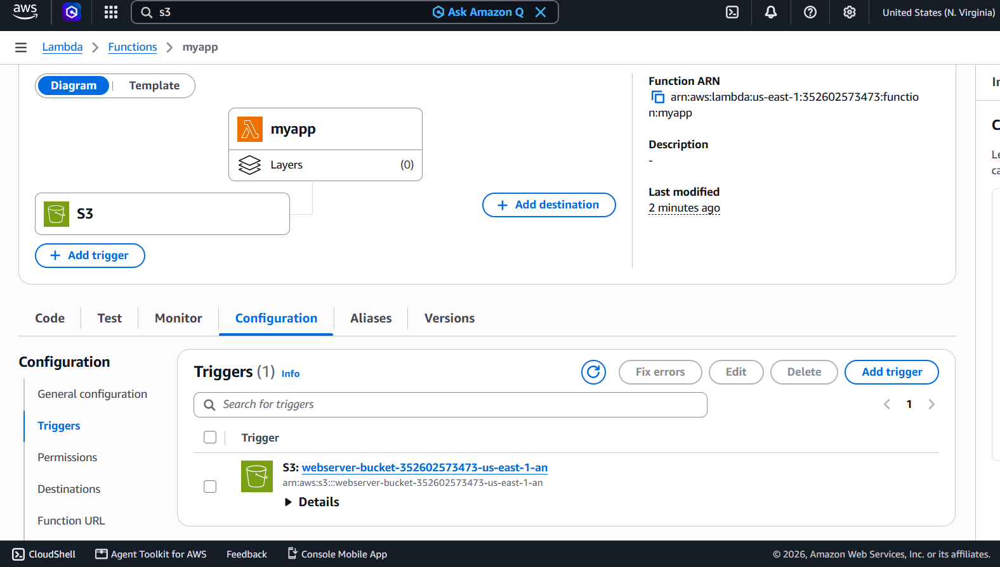
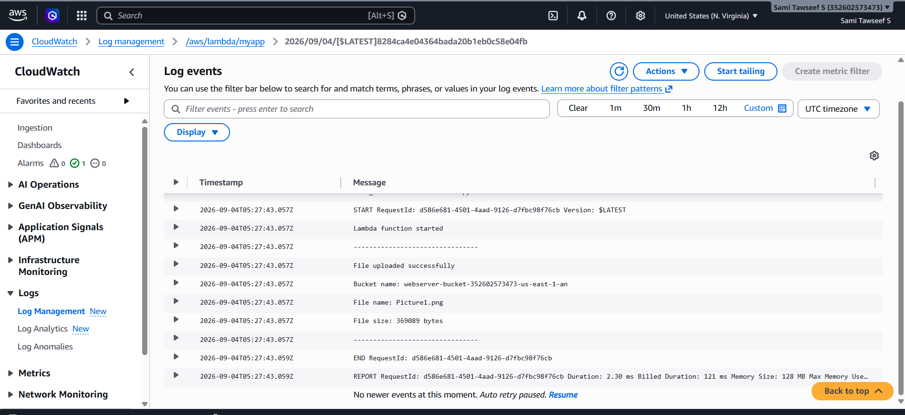
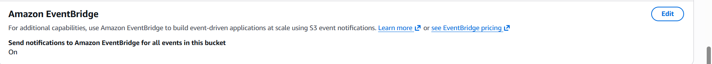
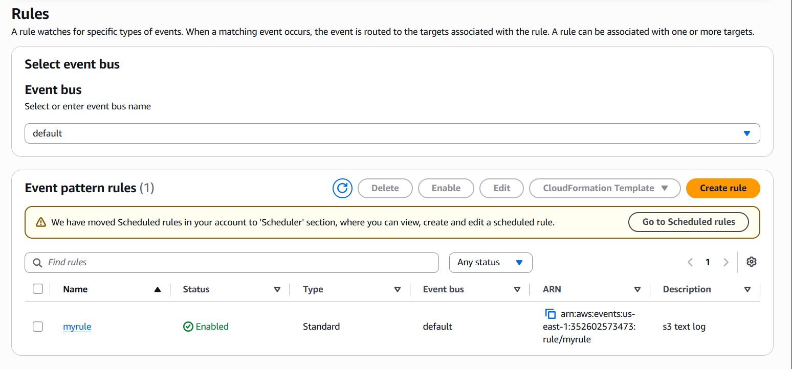
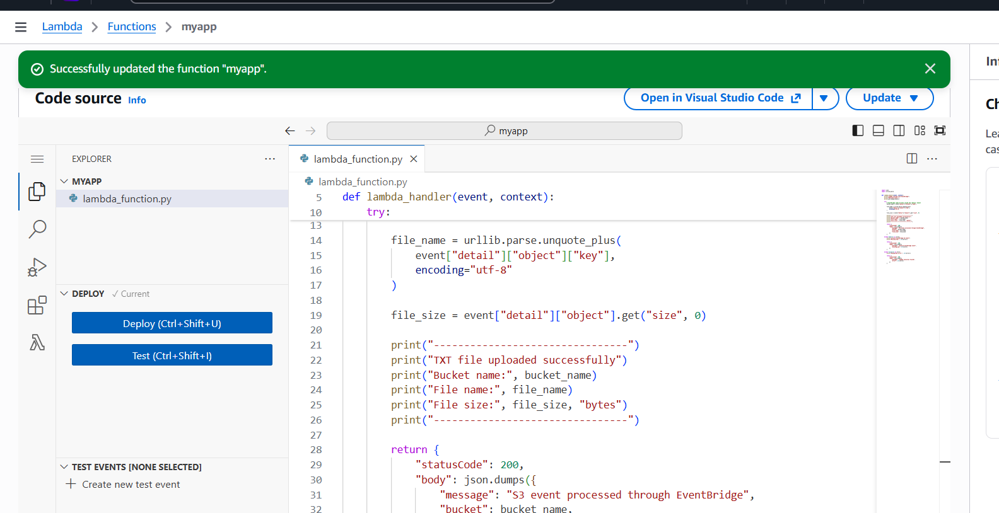
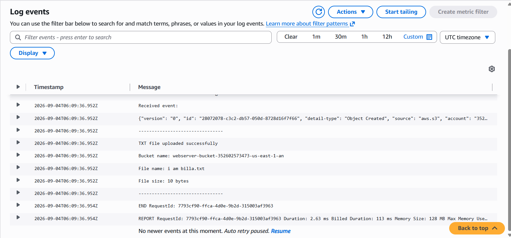

# AWS S3 → Lambda Complete Documentation

This project demonstrates two event-driven AWS file-processing architectures:

- **Direct S3 → Lambda → CloudWatch Logs**
- **S3 → EventBridge → Lambda → CloudWatch Logs**

## Architecture Comparison

| Architecture | Flow |
|---|---|
| Direct S3 → Lambda | Upload file → S3 ObjectCreated event → Lambda → CloudWatch Logs |
| S3 → EventBridge → Lambda | Upload file → S3 Object Created event → EventBridge rule → Lambda → CloudWatch Logs |

---

## Part A — Direct S3 → Lambda

### 1. Direct S3 → Lambda Overview

In this architecture, Amazon S3 directly invokes the Lambda function whenever an object is created in the configured bucket.

### 2. Create the S3 Bucket

1. Open the AWS Management Console.
2. Search for S3.
3. Click **Create bucket**.
4. Enter a unique bucket name.
5. Keep the required/default settings.
6. Click **Create bucket**.

### 3. Create the Lambda Function

1. Open AWS Lambda.
2. Select **Functions → Create function**.
3. Choose **Author from scratch**.
4. Enter a function name, for example `myapp`.
5. Select a Python 3.x runtime.
6. Use a basic Lambda execution role.
7. Click **Create function**.

### 4. Direct S3 Lambda Code

```python
import json
import urllib.parse

def lambda_handler(event, context):
    print("Lambda function started")
    try:
        record = event["Records"][0]
        bucket_name = record["s3"]["bucket"]["name"]
        file_name = urllib.parse.unquote_plus(
            record["s3"]["object"]["key"], encoding="utf-8"
        )
        file_size = record["s3"]["object"].get("size", 0)

        print("File uploaded successfully")
        print("Bucket name:", bucket_name)
        print("File name:", file_name)
        print("File size:", file_size, "bytes")

        return {
            "statusCode": 200,
            "body": json.dumps({
                "message": "S3 event processed successfully",
                "bucket": bucket_name,
                "file_name": file_name,
                "file_size": file_size
            })
        }
    except Exception as error:
        return {
            "statusCode": 500,
            "body": json.dumps({
                "message": "Lambda execution failed",
                "error": str(error)
            })
        }
```

### 5. Add S3 as the Lambda Trigger

1. Open the Lambda function.
2. Select **Configuration → Triggers**.
3. Click **Add trigger**.
4. Select **S3**.
5. Select the S3 bucket.
6. Select **All object create events**.
7. Optionally configure a `.txt` suffix/filter.
8. Complete the acknowledgement if AWS displays one.
9. Click **Add**.

### 6. Test Direct S3 → Lambda

1. Open the S3 bucket.
2. Click **Upload**.
3. Upload `test.txt`.
4. Open **Lambda → Monitor → View CloudWatch logs**.
5. Open the latest log stream and verify the bucket, file name, and file size.

## Direct S3 → Lambda Screenshots

### Figure 1



### Figure 2



### Figure 3



### Figure 4



### Figure 5



### Figure 6



---

## Part B — S3 → EventBridge → Lambda

### 7. EventBridge Architecture Overview

In this architecture, S3 sends object events to Amazon EventBridge. An EventBridge rule filters the event and invokes the Lambda function when the event matches the configured bucket and `.txt` suffix.

### 8. Enable EventBridge Notifications on S3

1. Open S3 and select the bucket.
2. Open the **Properties** tab.
3. Scroll to **Amazon EventBridge**.
4. Enable **Send notifications to Amazon EventBridge for all events in this bucket**.
5. Make sure the setting shows **On**.

### 9. Create the Lambda Function

1. Open AWS Lambda.
2. Select **Functions → Create function**.
3. Choose **Author from scratch**.
4. Enter the function name, for example `myapp`.
5. Select a Python 3.x runtime.
6. Use a basic Lambda execution role.
7. Click **Create function**.

### 10. EventBridge Lambda Code

```python
import json
import urllib.parse

def lambda_handler(event, context):
    print("Lambda started from EventBridge")
    print("Received event:")
    print(json.dumps(event))

    try:
        bucket_name = event["detail"]["bucket"]["name"]
        file_name = urllib.parse.unquote_plus(
            event["detail"]["object"]["key"], encoding="utf-8"
        )
        file_size = event["detail"]["object"].get("size", 0)

        print("TXT file uploaded successfully")
        print("Bucket name:", bucket_name)
        print("File name:", file_name)
        print("File size:", file_size, "bytes")

        return {
            "statusCode": 200,
            "body": json.dumps({
                "message": "S3 event processed through EventBridge",
                "bucket": bucket_name,
                "file_name": file_name,
                "file_size": file_size
            })
        }
    except Exception as error:
        return {
            "statusCode": 500,
            "body": json.dumps({
                "message": "Lambda execution failed",
                "error": str(error)
            })
        }
```

### 11. Create the EventBridge Rule

1. Open **Amazon EventBridge**.
2. Select **Rules**.
3. Click **Create rule**.
4. Enter a rule name, for example `myrule`.
5. Select the **default event bus**.
6. Continue to the event pattern configuration.

### 12. Configure the EventBridge Event Pattern

```json
{
  "source": ["aws.s3"],
  "detail-type": ["Object Created"],
  "detail": {
    "bucket": {
      "name": ["student-s3-eventbridge-demo-2026-unique"]
    },
    "object": {
      "key": [
        {
          "suffix": ".txt"
        }
      ]
    }
  }
}
```

### 13. Add Lambda as the EventBridge Target

1. In the EventBridge rule, configure the target.
2. Select **AWS service**.
3. Select **Lambda function**.
4. Choose the `myapp` Lambda function.
5. Review the configuration.
6. Click **Create rule**.

### 14. Test the EventBridge Workflow

1. Open the S3 bucket.
2. Click **Upload**.
3. Upload a `.txt` file such as `i am billa.txt`.
4. Wait for the EventBridge rule to process the event.
5. Open **Lambda → Monitor → View CloudWatch logs**.
6. Open the latest log stream.

## EventBridge Screenshots

### Figure 1


### Figure 2


### Figure 3


### Figure 4


### Figure 5


### Figure 6


---

## Direct S3 vs EventBridge

- Direct S3 → Lambda uses the S3 notification event structure, typically accessed through `event["Records"][0]["s3"]`.
- EventBridge S3 events use the EventBridge event structure, with bucket and object information under `event["detail"]`.
- Do not mix the two event formats. The Lambda code must match the trigger architecture.

## Final Result

**Direct architecture:** S3 → Lambda → CloudWatch Logs

**EventBridge architecture:** S3 → EventBridge → Lambda → CloudWatch Logs

## Conclusion

Both architectures provide event-driven file processing. The direct S3-to-Lambda method is simpler, while EventBridge provides an event-routing layer where rules can filter and route events to targets.
